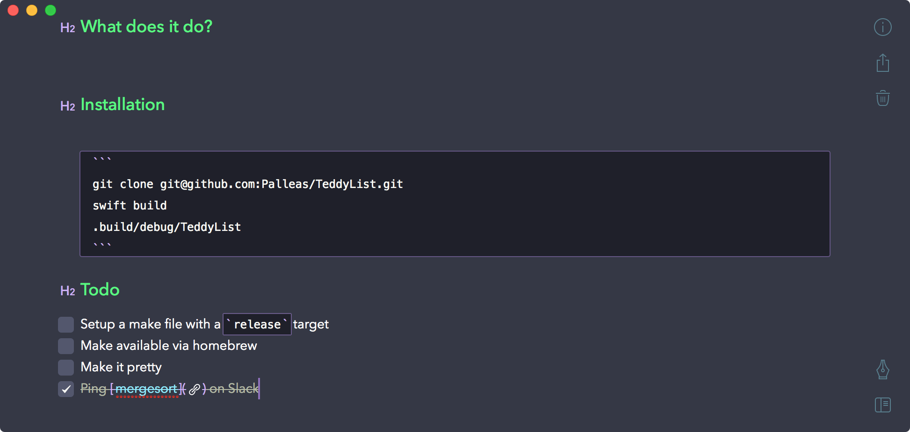
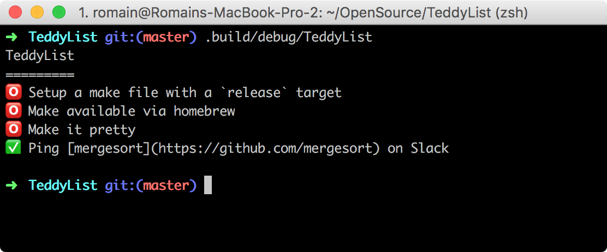

# TeddyList

Extract TODO lists from [Bear](http://www.bear-writer.com) notes.

## What does it do?

Take the following note:



Run the tool:



## Installation

```
git clone git@github.com:Palleas/TeddyList.git
swift build
.build/debug/TeddyList
```

## Todo
- [ ] Setup a make file with a `release` target
- [ ] Make available via homebrew
- [ ] Make it pretty
- [x] Ping [mergesort](https://github.com/mergesort) on Slack

## Super special thanks

* [Bear](http://www.bear-writer.com) for being awesome
* [Bears](https://www.forestanimalrescue.org/the-rescued-tigers-and-bears-have-arrived/)  for being awesome
* [BearNanny](https://github.com/oderwat/BearNanny) for being an example of unexpected stuff you can do with Bear

## License

[MIT](LICENSE).
